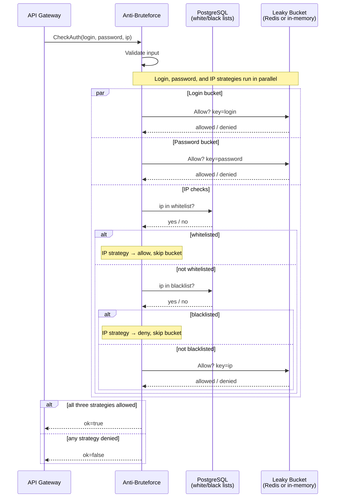

# Rate Limiting Flow

How the service processes a `CheckAuth` request.

## Bucket behaviour

Each bucket is a leaky bucket: it drains at a constant rate and is capped at a maximum level.
A request is allowed when adding one token does not exceed the capacity; denied otherwise.

| Strategy | Default capacity | Window |
|---|---|---|
| Login | 10 | 60 s |
| Password | 1000 | 60 s |
| IP | 1000 | 60 s |

Capacities are configurable via `configs/config.yaml`.

## Storage

When Redis is configured the buckets are persisted there and shared across instances.
Without Redis each instance keeps its own in-memory buckets.

White/black lists are always stored in PostgreSQL and consulted on every request.
